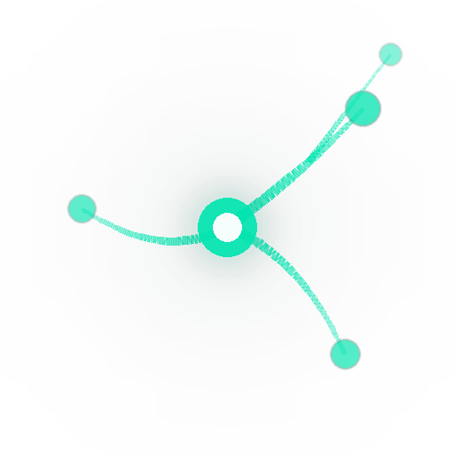

<p align="center">
  <picture>
    <source media="(prefers-color-scheme: dark)" srcset="assets/logo_dark_512.png">
    <source media="(prefers-color-scheme: light)" srcset="assets/logo_light_512.png">
    
  </picture>
</p>

<h1 align="center">Myco</h1>

<p align="center"><b>Devour everything. Evolve forever. You just talk.</b></p>

<p align="center">
  <a href="https://pypi.org/project/myco/"></a>
  <a href="https://www.python.org/"></a>
  <a href="LICENSE"></a>
  <a href="https://github.com/Battam1111/Myco"></a>
</p>

<p align="center">
  <a href="#quick-start">Quick Start</a> · <a href="#what-it-does">What It Does</a> · <a href="#why-its-different">Why It's Different</a> · <a href="#architecture">Architecture</a>
</p>

<p align="center">
  <b>Languages:</b> English · <a href="README_zh.md">中文</a> · <a href="README_ja.md">日本語</a>
</p>

---

You used LangChain in 2024. Someone said LangGraph was better. Then CrewAI. Then DSPy. Then Hermes. Every month a new framework promised to be the one. You spent more time picking tools than building anything with them.

And it wasn't just frameworks. Papers, blog posts, best practices, new models, new APIs, new paradigms — everything refreshing every single day. You followed 50 repos, read 3. Bookmarked 200 articles, opened 10. Your note app had 500 entries. Last organized: three months ago. Maybe longer.

It's not that you're lazy. **The world is moving faster than anyone can keep up with.**

Here's the part that really stings — those notes you carefully organized, those lessons you wrote down, those "how did I do this last time" entries — they're rotting. That API call you documented three weeks ago? Version changed. That best practice from last month? The community already moved on. Your knowledge base keeps growing, but how much of it is still true? Nobody knows. **Nothing is checking for you.**

Your notes don't tell you "this one's outdated." Your bookmarks don't merge duplicates on their own. Your AI doesn't remember what you decided last week. Every new conversation — back to zero.

<br>

Now imagine living differently.

You don't organize notes. You don't compare frameworks. You don't chase papers. You don't re-explain your project to your AI every time. You just talk like a normal person.

But six months later, your AI is sharper than anyone else's. It knows the full history of every project you've touched. It devoured the latest papers and tools in your field on its own. It found its own blind spots and filled them in. It checked every piece of old knowledge to see if it was still true — whatever wasn't, it threw out. It even rewrote its own operating rules, because the old ones weren't good enough anymore.

This isn't science fiction.

<h3 align="center">This is Myco.</h3>

---

## Quick Start

```bash
git clone https://github.com/Battam1111/Myco.git
cd Myco && pip install -e ".[mcp]"
myco init --auto-detect my-project
```

Three commands. Auto-detects your environment — Claude Code · Cursor · VS Code · Codex · Cline · Continue · Zed · Windsurf · Cowork — finds what you have, configures all of it in one shot.

Editable install — the entire system is yours to rewrite, including the engine itself. Don't want to touch it? Fine. It evolves on its own.

## What It Does

- 🧬 **Devour everything** — Papers, code, blog posts, conversations — feed it anything and it digests it into capability, not files
- 🛡️ **Self-check** — Automatically detects stale knowledge, contradictions, and gaps without you lifting a finger
- 💀 **Kill what's dead** — Outdated knowledge gets detected and purged. A knowledge system without excretion is a tumor
- 🔄 **Evolve forever** — Not just the content evolving — the engine's own rules mutate too. The whole system is alive
- 🍄 **Connect everything** — Every file is a node in a mycelial network. Knowledge isn't isolated records — it's a web that grows denser over time
- 🤖 **You just talk** — 21 tools, fully automated. Humans don't need to understand a single technical detail

## Why It's Different

|  | Store and forget | Compile and hope | **Myco** |
|---|---|---|---|
| After ingestion | Sits there | Gets organized once | **Digested, verified, compressed, connected, excreted** |
| When knowledge goes stale | Nobody notices | Nobody notices | **Auto-detected, auto-purged** |
| As knowledge grows | Bloated | Bloated | **Distilled** |
| When new tools appear | You switch manually | You migrate manually | **It devours the best parts on its own** |
| Over time | Messier | Staler | **Smarter** |

## Architecture

```
You (just talk)
  ↓
AI Agent (thinks, executes)
  ↓ auto-connected
Myco (devours, digests, verifies, evolves)
  ├── Knowledge atoms (lifecycle-aware — what should die, dies)
  ├── Refined knowledge (long-term truths distilled from atoms)
  ├── Skills (self-evolving operating procedures)
  ├── Engine code (editable, mutable — yes, even the code itself evolves)
  └── Source of truth (single authority for all numbers and rules)
```

Three roles: you set direction, the Agent brings intelligence, Myco brings memory and evolution. None works without the others.

## Contributing

```bash
git clone https://github.com/Battam1111/Myco.git
cd Myco && pip install -e ".[mcp,dev]"
pytest tests/
```

See [CONTRIBUTING.md](CONTRIBUTING.md) · MIT — [LICENSE](LICENSE)
