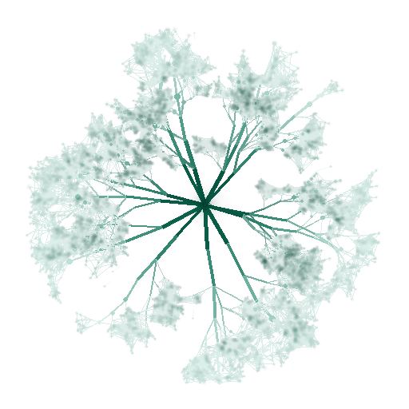

<p align="center">
  <picture>
    <source media="(prefers-color-scheme: dark)" srcset="assets/logo_dark_512.png">
    <source media="(prefers-color-scheme: light)" srcset="assets/logo_light_512.png">
    
  </picture>
</p>

<h1 align="center">Myco</h1>

<p align="center"><b>すべてを喰らう。永遠に進化する。あなたはただ話すだけ。</b></p>

<p align="center">
  <a href="https://pypi.org/project/myco/"></a>
  <a href="https://www.python.org/"></a>
  <a href="LICENSE"></a>
  <a href="https://github.com/Battam1111/Myco"></a>
</p>

<p align="center">
  <a href="#はじめに">はじめに</a> · <a href="#何ができるか">機能</a> · <a href="#なぜ違うのか">差別化</a> · <a href="#アーキテクチャ">構造</a>
</p>

<p align="center">
  <b>Languages:</b> <a href="README.md">English</a> · <a href="README_zh.md">中文</a> · 日本語
</p>

---

2024年、LangChain を使った。2025年、LangGraph のほうがいいと言われた。次は CrewAI。そして DSPy。Hermes。毎月誰かが「これこそ最高のフレームワークだ」と言う。ツールを選ぶのに費やした時間のほうが、どのツールで何かを成し遂げた時間より長い。

フレームワークだけじゃない。論文、ブログ、ベストプラクティス、新モデル、新API、新パラダイム――毎日更新される。50のリポジトリをフォローして、読んだのは3つ。200の記事をブックマークして、読んだのは10。ノートアプリには500件のメモがある。最後に整理したのは3ヶ月前。

努力が足りないんじゃない。**この世界はもう、誰も追いつけない速さで動いている。**

もっと痛いのは――苦労して整理したメモ、あの経験、あの「前はどうやったっけ」――腐りかけている。3週間前に書いたAPIの呼び方、バージョンが変わった。先月まとめたベストプラクティス、コミュニティはもうひっくり返した。知識ベースはどんどん大きくなるのに、そのうちどれだけがまだ正しいか？ 誰も知らない。**何もチェックしてくれるものがない。**

メモは「これはもう古いよ」と教えてくれない。ブックマークは重複を自動でまとめてくれない。AIは先週あなたが何を決めたか覚えていない。新しい会話を開くたびに――すべてゼロからやり直し。

<br>

別の生き方を想像してみろ。

メモを整理しない。フレームワークを比較しない。論文を追わない。AIにプロジェクトの背景を繰り返し説明しない。バカみたいにただ人間の言葉で話す。

でも6ヶ月後、あなたのAIは誰のよりも賢い。すべてのプロジェクトの完全な履歴を知っている。あなたの分野の最新の論文やツールを自動で喰らった。知識の盲点を自分で見つけて埋めた。古い知識がまだ正しいか自分でチェックした――間違っていたものは、もう捨てた。自分の作業ルールさえ書き換えた。古いルールでは足りなかったから。

<h3 align="center">これが Myco だ。</h3>

---

## はじめに

```bash
git clone https://github.com/Battam1111/Myco.git
cd Myco && pip install -e ".[mcp]"
myco init --auto-detect my-project
```

3行のコマンド。環境を自動検出――Claude Code · Cowork · Cursor · VS Code · Codex · Cline · Continue · Zed · Windsurf――検出したものを全部一発で設定。

編集可能インストール――エンジン自体を含むシステム全体を書き換えられる。いじらなくてもいい、勝手に進化する。

## 何ができるか

- 🧬 **すべてを喰らう** — 論文、コード、ブログ、会話――何でも食わせろ。ファイルとして保存するんじゃない、自分の能力に消化する
- 🛡️ **自己診断する** — 知識が古くないか、矛盾していないか、漏れがないか、自動でチェックする
- 💀 **死ぬべきものは死ぬ** — 古くなった知識は自動で検出・除去される。排泄のない知識システムは腫瘍だ
- 🔄 **永遠に進化する** — コンテンツだけじゃない、エンジン自体のルールも変異する。システム全体が生きている
- 🍄 **すべてが繋がる** — すべてのファイルが菌糸ネットワークのノード。知識は孤立した記録じゃない、どんどん密になる網だ
- 🤖 **あなたはただ話すだけ** — 19のツールが全自動。人間は技術的な詳細を一切知らなくていい

## なぜ違うのか

|  | 保存して終わり | コンパイルして終わり | **Myco** |
|---|---|---|---|
| 入れた後 | 置いてある | 少し整理する | **消化・検証・圧縮・接続・排泄** |
| 知識が古くなったら | 誰も気にしない | 誰も気にしない | **自動検出、自動除去** |
| 知識が増えたら | どんどん膨れる | どんどん膨れる | **どんどん精錬される** |
| 新しいツールが出たら | 手動で切り替え | 手動で移行 | **新ツールの精髄を自動で喰らう** |
| 時間が経つほど | 散らかる | 古くなる | **賢くなる** |

## アーキテクチャ

```
あなた（人間の言葉で話す）
  ↓
AI Agent（思考・実行）
  ↓ 自動接続
Myco（喰らう・消化する・検証する・進化する）
  ├── 知識原子（ライフサイクルがある、死ぬべきものは死ぬ）
  ├── 精錬知識（原子から抽出した長期知識）
  ├── スキル（自己進化する操作手順）
  ├── エンジンコード（編集可能、変異可能――そう、コード自体も進化する）
  └── 免疫システム（知識が腐った？自分で見つけて、自分で対処する）
```

3つの役割：あなたが方向を、Agentが知性を、Mycoが記憶と進化を。どれが欠けても成り立たない。

## 参加する

```bash
git clone https://github.com/Battam1111/Myco.git
cd Myco && pip install -e ".[mcp,dev]"
pytest tests/
```

詳しくは [CONTRIBUTING.md](CONTRIBUTING.md) · MIT — [LICENSE](LICENSE)
