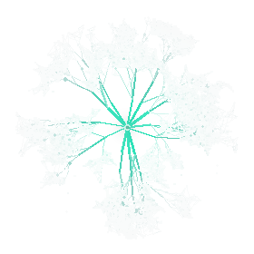

<div align="center">



# Myco

**面向 AI 智能体的自主认知基质（Autonomous Cognitive Substrate）。**

*你的智能体是 CPU。Myco 是 CPU 以外的一切 —— 而这个操作系统（OS）能自己升级自己。*

[](https://github.com/Battam1111/Myco)
[](https://www.python.org/)
[](LICENSE)
[](#三条不可动摇的宪法)

[活的基质](#活的基质) · [五项核心能力](#五项核心能力) · [如何与-myco-协作](#如何与-myco-协作) · [三条不可动摇的宪法](#三条不可动摇的宪法) · [五十年的肩膀](#五十年的肩膀) · [今天就上手](#今天就上手)

**语言：** [English](README.md) · 中文（当前） · [日本語](README_ja.md)

</div>

---

## 活的基质

现代 LLM 智能体才华横溢，却患上了健忘症。每次会话都是 CPU 的一次冷启动 —— 只有原始算力，没有任何持久化。昨天学到的东西，在会话边界处蒸发；团队上个月的共识，在无人察觉的角落烂成矛盾。智能体脚下的"地面"根本不是地面，只是一堆祈祷能跟上现实的静态文件。

Myco 就是那片真正的地面。

> **Myco 是面向 AI 智能体的自主认知基质（Autonomous Cognitive Substrate）。你的智能体是 CPU：只有原始算力，没有持久化。Myco 是 CPU 以外的一切 —— 内存、文件系统、操作系统、外设 —— 而这个 OS 能自己升级自己（OS 自己升级自己）。所有进化都是非参数的（non-parametric / 非参数的）：磁盘上的文本、结构、lint 规则。权重永不被触碰（weights never touched / 权重永不）。这就是为什么 Myco 可以跨智能体厂商工作、在模型替换中幸存，并且在 LLM 智能体最擅长操作的介质里持续积累价值。**

这个说法不是把隐喻包装成架构，它**就是**架构本身。**内核（kernel / 内核）**是项目无关的认知 OS；每个项目目录都是一个**实例（instance / 实例）** —— 运行在这个 OS 上的"应用程序"。内核的升级向下游扩散；实例里发现的摩擦沿上游回流。基质（substrate / 基质）在热力学意义上是活的：它**代谢（metabolize / 代谢 / 消化系统）**进来的知识，把它压缩成你的智能体注意力真正用得上的形状，并**排出（excrete / 淘汰）**那些不再值得占位的部分。一个停止代谢的基质不是稳定的知识库 —— 它是一具尸体。**停滞即死（Stagnation / 停滞即死）。** **永恒进化（Perpetual Evolution / 永恒进化）** 不是 nice-to-have，而是让基质继续成其为基质的唯一前提。

---

## 五项核心能力

Myco 不是记忆层，不是智能体运行时，也不是技能框架。它是三者之下的那一层 —— 它们赖以运行的活地面。五项能力定义这片地面做什么。

### 1. 知识代谢 —— 七步管道

记忆层负责存与取；基质负责**代谢（metabolism）**。每一份进入的内容 —— 一篇论文、一次摩擦、一次聊天中的设计决策 —— 都要经过七步（七步 / seven-step）管道：

**Discover → Evaluate → Extract → Integrate → Compress → Verify → Excrete（排出 / 淘汰）**

Discover 扫描入口通道。Evaluate 判断这份内容是否值得占用基质的注意力。Extract 抽出承重结构。Integrate 把它接入已有的知识体。Compress 剪掉一切不再赚得注意力的东西。Verify 检查压缩是否破坏了承重的主张。**Excrete（排出 / 淘汰）** —— 大多数知识系统都忘掉的那一步 —— 主动把已经腐烂、被取代或不再为真的知识清出系统。**没有出口的消化道是肿瘤。** 七步管道是 Myco 最核心的代谢动作，所有命令都以它为骨架命名：`eat` / `evaluate` / `extract` / `integrate` / `compress` / `view` / `prune` / `hunger`。

### 2. 元进化 —— 基质改写自己的规则

每个 LLM 系统都在进化**智能体的行为**；Myco 进化的是**智能体脚下的地面**。当某条 lint 规则不再抓到真问题，或者开始频繁误报，或者 canon schema 长出了自己 —— Myco 的四齿轮进化引擎会察觉并提出改动。Gear 1 在正常工作中感知摩擦；Gear 2 在会话结束时反思基质本身该如何改进；Gear 3 在里程碑处挑战结构性假设；Gear 4 在项目结束后把普适模式蒸馏回内核。除了这四个向内的齿轮，还有第五张面 —— **代谢入口（metabolic inlet）** —— 是向外的，负责把外部论文、代码仓、文章拉进来。进化的机制是**变异与选择（mutation / 变异 & selection / 选择压力）**：系统产生候选变更，人类是决定哪些变异可以存活的**选择压力**。

### 3. 自我模型（Self-Model） —— 一个认识自己的基质

Myco 维护一个四层自我模型（四层自我 / Self-Model），让它在任何时刻都能回答"我现在装着什么、它还活着吗"：

- **A · 库存（Inventory / 库存）** —— 当前基质里有什么（自动化）。
- **B · 缺口感知** —— 基质**应该**知道但现在还不知道的东西（半自动化）。
- **C · 退化感知（decay / 退化）** —— 曾经为真、现在已经不再为真的东西。分为*事实退化*（版本漂移、文件改名）和*结构退化*（第 3 天还正确的架构，到第 30 天就错了）。事实退化是 `myco lint` 已经抓得住的；**结构退化**是整个设计空间里最硬的开放问题。
- **D · 有效性** —— **死知识检测**：进了基质之后再也没被读过的笔记。如果知识不被消费，那就不是知识，而是沉积物。

这个自我模型让 Myco 可以问出对活知识系统来说唯一重要的那个问题：*这一条还在挣得它的位置吗？*

### 4. 跨会话延续性 —— 比任何一次对话更长寿的基质

基质之上的一切都是短暂的 —— 对话结束、模型换代、运行时重启。Myco 是那个留下来的东西。它是下一次会话**完整**继承的那唯一一份资产，无论下次换的是哪家厂商的智能体。过去每个周一早上都要重新发现的隐性知识变得持久；"摸清一个项目"的昂贵过程只发生一次。

### 5. 智能体自适应普适性 —— 基质向智能体变形

基质不是一个预先刻好的模具，等着智能体去适配。Myco 的入口、压缩规则、lint 阈值都被期望随着正在操作它的那个智能体（Claude、GPT、Cursor、Claude Code、或者我们还没见过的未来模型）而演化。普适性的方向是正确的：**地面适配树，而不是树适配地面。**

---

## 整体图景

```
                   ┌─────────────────────────────────────┐
                   │          LLM 智能体 (Agent)         │
                   │    (CPU —— 只有原始算力，无 RAM)    │
                   └──────────────▲──────────────────────┘
                                  │ 9 个 MCP 工具 + CLI
                                  │ (read / eat / digest / lint …)
                   ┌──────────────┴──────────────────────┐
                   │          Myco 内核 (kernel / OS)    │
                   │  代谢 · 自我模型 · lint ·           │
                   │  四齿轮 · 代谢入口                  │
                   │      ↑ upstream 回流               │
                   │      ↓ 内核下发                     │
                   └──────────────┬──────────────────────┘
                                  │
      ┌───────────────────────────┼────────────────────────────┐
      ▼                           ▼                            ▼
 ┌─────────┐                ┌─────────┐                  ┌─────────┐
 │  项目   │                │  项目   │                  │  项目   │
 │实例 A   │                │实例 B   │                  │实例 C   │
 └─────────┘                └─────────┘                  └─────────┘
     （实例 / instance —— wiki / _canon / notes / log 构成的"应用程序"）
```

**内核**是项目无关的认知 OS：共享代码、共享 lint 引擎、共享进化协议。**实例**是你的项目目录 —— 运行在 OS 上的应用程序。内核升级时会下发到每个实例；实例里发现的摩擦和蒸馏出的模式通过 upstream outbox 回流到内核。这不是类比，它就是 Myco 的物理结构，L11 lint 维度强制维护这条 write-surface 卫生线。

---

## 如何与 Myco 协作

传统知识库假设"人类作者 + 机器读者"。Myco 把这个颠倒过来。**你的智能体才是基质的主要主体** —— 它读基质、写基质、提出改动、在基质上跑日常工作。你是**偶尔出场的守门人**：是批准变异、否决坏方向、在结构性假设需要被挑战时召开传统手艺会议的那个"**选择压力**"。

协作的三条动力学：

**变异与选择（mutation / selection / 变异 / 选择压力）。** Myco 负责变异；你负责选择。系统不断产生新的知识条目、新的 lint 规则、新的压缩策略；你的角色不是亲手写这些提案，而是判断哪些值得存活。持之以恒地施加的选择压力，是让一个自进化基质不滑向癌变的唯一机制。

**透明（Transparent / 透明）作为生存机制。** Myco 里的每一次改动都透明可审计：每条笔记有出处，每条 lint 规则有辩论记录，每次内核升级有 upstream bundle。这不是官僚主义美德，而是一条因果链：**透明 → 可读 → 人类选择压力 → 反癌化（anti-cancer / 癌变）**。失去透明 → 失去可读性 → 失去选择压力 —— 一个自我优化的基质就会朝着没人能评估的方向**癌化（癌变 / cancerous）**。透明是免疫系统，不是公文表格。

**智能体即主体（agent-as-subject）。** 经典的"第二大脑（Second Brain）"把人类放在驾驶座、把工具放在副驾。Myco 把它倒了过来。智能体是主要的读者、写者、在基质上思考的那个主体；你在需要选择、战略或结构判断的时候介入。这个反转，正是**基质**区别于"个人知识管理器"的根本所在。

---

## 三条不可动摇的宪法

Myco 里几乎一切都可以进化 —— 知识结构、压缩规则、lint 维度、甚至进化引擎本身。一切，除了下面这三条。L9 lint 维度强制基质身份不漂移；L13 lint 维度强制每一次规则变更都留下可审计的传统手艺记录。

| # | 宪法 | 为什么它承重 |
|---|------|--------------|
| **C1** | **可达（Accessible）** | 任何厂商的任何智能体都必须能找到入口并自解释整个基质。地面如果不可达，树就长不起来。 |
| **C2** | **透明（Transparent / 透明）** | 每一次改动都必须可被人类审计。这是人类选择压力作用于自进化系统的通道。失去透明 → 失去选择压力 → 基质走向**癌化（癌变）**。 |
| **C3** | **永恒进化（Perpetual / 永恒进化）** | **停滞即死（Stagnation / 停滞即死）。** 一个停止代谢的基质，定义上已经不再是基质；它是静态知识库 —— 正是 Myco 被构造出来要逃离的那种失败模式。 |

这三条是宪法。其余一切都是立法。

---

## 压缩即认知（Compression Is Cognition / 压缩）

Myco 的运行假设：

> **存储无限，注意力有限（注意力有限）。**

硬盘按需增长；你的智能体的上下文窗口不会。因此 Myco **从不遗忘** —— 冷存储里一个字节都不删 —— 但它**激进地压缩（Compression / 压缩）**流入注意力的那一部分。压缩不是工程管道，它是**基质最核心的认知动作**。三条候选标准：

- **使用频率**：没人读的页面进入冷区。
- **时间相关性**：有时限的事实在过期时排出。
- **排他性**：你的智能体靠预训练就已经知道的内容，在基质里是浪费位置；只保留你的智能体本来就不会知道的东西。

压缩也是**智能体自适应**的：对一个智能体必须写下来的东西，对另一个预训练更强的智能体可能是冗余。基质向智能体调整；不是反过来。不可约的纹理会故意丢失 —— 如果你需要字面级保真，请单独保留一份 raw 存档。基质保下来的是承重结构：出处链、决策、事情为什么为真的理由。

---

## 五十年的肩膀

Myco 不是从天上掉下来的。它站在五个传统的肩膀上，每一个都贡献了一条承重的洞见：

- **Karpathy LLM Wiki** —— 结构化的知识编译才是智能体的正确基质形状，而不是聊天日志或向量库。这是几何学假设。
- **Polanyi 隐性知识** —— 大部分操作智慧是隐性的、栖于 proximal/distal 结构中，无法用枚举捕获。这是 Myco 为什么持久化"过程与叙事"而不仅仅是"事实"的原因。
- **Argyris 双环学习** —— 单环学习修正行动，双环学习修正支配行动的规则。这就是 L-struct / L-meta 的分层，也是基质本身必须进化的理由。
- **Toyota PDCA** —— Plan / Do / Check / Act 是自改进系统的基础循环。四齿轮正是 PDCA 在 LLM 基质上的编译形态。
- **Voyager 技能库** —— 迭代式、基于 grounded 执行的技能积累是可能的，只要你记住什么曾经奏效并让下一集在它上面继续生长。这是 Gear 4 蒸馏的形状。

Myco 是第一个把这五个放到同一个基座上、让它们作为同一套代谢运转起来的系统。详见 [`docs/theory.md`](docs/theory.md)。

---

## 一直在无意识地运行

那个令人不安却承重的真相：**我们早就在不自觉地运行这个系统的原始版本了。** 一个 8 天、80+ 文件的强化学习研究项目 —— ASCC —— 完整手工跑完了四齿轮循环。手动触发的 lint、口头的摩擦日志、人工驱动的元进化、15+ 次结构化辩论。它奏效了。然后在下一个项目上**又**奏效了。

<div align="center">

| 80+ 文件 | 10 个 wiki 页面 | 15+ 次结构化辩论 | 15/15 lint 维度全绿 |
|:--------:|:---------------:|:----------------:|:-------------------:|

</div>

Myco 是一个已经在野外自证过的模式的**形式化**。v0.x → v1.0 的路径不是"发明新东西"，而是"让靠手跑起来的东西开始自己跑"。通过 Gear 4 提取出来的模式现在住在内核代码里；那份无意识原型的源头是 [`examples/ascc/`](examples/ascc/)。我们不是在请你相信一套理论，而是在请你相信一个已经在 80+ 文件、15+ 辩论的紧张研究项目里证明过自己的模式 —— 并帮我们拧紧那几个能让它在"人不当引擎"的情况下继续转的旋钮。

---

## 开放问题

Myco 还很早。你能做出的最高杠杆贡献，是挑下面这六条里的一条往前推：

1. **冷启动。** 基质怎样在一个没有历史、没有 canon、没有摩擦记录的全新项目上 bootstrap？当前答案：手工打磨的 `myco init` 模板。目标：基质从过往蒸馏中自学 bootstrap。
2. **触发信号。** 什么触发 Gear 2？什么触发代谢入口？摩擦计数是个代理，真正的信号还是个开放研究问题。
3. **深度对齐。** 如果 Myco 进化到人类已经无法有效评估其规则的深度，如何保持对齐？透明是必要但不充分 —— 我们需要**可读的透明**在规模下依然成立。
4. **压缩工程。** 在不丢失承重隐性知识的前提下，丢什么、何时丢？三条候选标准是起点，不是答案。
5. **结构退化检测（自我模型 C 层）。** 事实退化已经能抓；结构退化 —— 第 3 天正确、第 30 天已错的架构 —— 还抓不住。这可能是整个设计空间里最硬的问题。
6. **死知识追踪（自我模型 D 层）。** 最小可行种子已落地（Wave 18，v1.4.0）—— `myco view` 写入 `view_count` + `last_viewed_at`，`myco hunger` 输出 `dead_knowledge` 信号，`myco prune`（Wave 33）是自动排出路径。仍开放：view 审计日志、cross-reference 图、随基质年龄进化的自适应阈值。

持续维护的登记在 [`docs/open_problems.md`](docs/open_problems.md)。如果你想做高影响力的贡献，挑一条，开跑。

---

## 今天与明天

| 阶段 | 已为真 | 即将到来 |
|------|--------|----------|
| **v0.x（今天）** | 四个向内齿轮已出货 · 22 维 lint 全绿 · 代谢 CLI 上线 · MCP 服务器暴露 9 个工具 · 内核/实例分离强制执行 · 一个无意识原型（ASCC）端到端验证 · 自我模型 D 层种子已落地（view 跟踪 + dead_knowledge 信号 + `myco prune` 自动排出）· 代谢入口 MVP scaffold 已出货（`myco inlet`，Wave 35 / v0.27.0）· L19 维度计数一致性 lint（Wave 38 / v0.29.0）· L20 翻译镜像一致性 lint（Wave 39 / v0.30.0）· L21 contract 版本内联一致性 lint（Wave 40 / v0.31.0） | 入口冷启动、自主触发信号、持续压缩仍开放。大多数齿轮触发仍是人工。 |
| **v1.0** | 代谢入口完全自主 · 自我模型 D 落地 · 结构退化检测器播种 · 学习到的启发式取代手工触发信号 | 人类不再是引擎；人类严格仅作为选择压力存在。 |
| **v∞** | 内核的进化已经没有任何单个人能把它的整体结构装进脑子 —— 但**任何**人依然能审计**任何**一次改动，因为 C2 透明永不松开。 | 开放问题。这里 [开放问题 3](#开放问题) 变成承重。 |

---

## 今天就上手

如果你想停止阅读、开始运行：

```bash
# 从源码安装（PyPI 即将发布）
pip install git+https://github.com/Battam1111/Myco.git

# 在内核上启动一个新实例
myco init my-project --level 2

# 或者迁移一个现有项目（非破坏性；你的 CLAUDE.md 原封不动）
myco migrate ./your-project --entry-point CLAUDE.md
myco lint --project-dir ./your-project     # 建立基质基线
myco hunger --project-dir ./your-project   # 代谢仪表盘
```

**MCP 集成** —— 你的智能体自动获得 9 个工具，无需人工提示：

```bash
pip install 'git+https://github.com/Battam1111/Myco.git#egg=myco[mcp]'
```

仓库内自带一份开箱即用的 `.mcp.json`。装到 Claude Code、Cursor 或任何说 MCP 的客户端后，你的智能体自动发现：

- **基质健康**：`myco_lint` · `myco_status` · `myco_search` · `myco_log` · `myco_reflect`
- **知识代谢**：`myco_eat` · `myco_digest` · `myco_view` · `myco_hunger`

光用 CLI 已经够。MCP 层是把"捕获"从动作变成反射的那一层。

### 生物学词汇一表通

Myco 的动词是故意用的隐喻 —— 代谢就是正确的心智模型。

| Myco 动词 | 大白话 | CLI | MCP 工具 |
|---|---|---|---|
| `eat` | 把一段内容捕获为持久笔记 | `myco eat` | `myco_eat` |
| `digest` | 把笔记沿生命周期推动（raw → digesting → extracted → integrated → excreted 排出） | `myco digest` | `myco_digest` |
| `evaluate` | 评估一条 raw 笔记是否适合基质（提取 / 丢弃 / 暂搁） | `myco evaluate` | （仅 CLI） |
| `extract` | 把承重结构从 digesting 笔记里抽出来 | `myco extract` | （仅 CLI） |
| `integrate` | 把 extracted 笔记接入已有知识体 | `myco integrate` | （仅 CLI） |
| `compress` | 把多条重笔记压缩成一条轻摘要并保留 `.original` 原件 | `myco compress` | （仅 CLI） |
| `uncompress` | 从 `.original` 恢复压缩前的原件 | `myco uncompress` | （仅 CLI） |
| `prune` | D 层自动排出：扫描死知识笔记并打 excreted 标 | `myco prune` | （仅 CLI） |
| `view` | 按过滤器读笔记（同时写入 `view_count` + `last_viewed_at`） | `myco view` | `myco_view` |
| `lint` | 22 维基质健康检查（别名：`myco immune`） | `myco lint` | `myco_lint` |
| `correct` | 应用上一次 lint 的自动修复（别名：`myco molt`） | `myco correct` | （仅 CLI） |
| `forage` | 把外部资源拉进代谢入口 | `myco forage` | （仅 CLI） |
| `inlet` | 代谢入口 MVP —— 从配置好的源做 discover/evaluate/extract | `myco inlet` | （仅 CLI） |
| `hunger` | 代谢仪表盘：raw 积压、陈旧笔记、死知识 | `myco hunger` | `myco_hunger` |
| `absorb` | 从下游实例同步内核改进 | `myco upstream absorb` | （仅 CLI） |

---

## 贡献

见 [CONTRIBUTING.md](CONTRIBUTING.md)。最高影响力的贡献方向是：

1. **战斗报告**：对六条 [开放问题](#开放问题) 中任一条的实战反馈。
2. **平台适配器**：在 [`docs/adapters/`](docs/adapters/) 里为你自己在用的智能体环境写一个适配。
3. **代谢入口原语的设计草图**：尤其是 discover / evaluate / extract 阶段。
4. **README 翻译**：当前已有 [English](README.md) · 中文（本文件） · [日本語](README_ja.md)。

## 许可证

MIT —— 见 [LICENSE](LICENSE)。

---

## 菌丝（Mycelium）

这个名字不是装饰。菌丝是每片森林地下的真菌网络：它**不是**管道。它分泌酶把落叶分解成养分（**代谢**）。它记住有效的生长路径并据此调整策略（**元进化**）。它把富集区的资源重新分配给匮乏区（**智能压缩**）。它与遇到的任何树种的根形成共生（**智能体自适应普适性**）。一片健康的菌丝，是一片森林成其为"森林"而不仅仅是"一丛孤树"的原因。

智能体是地面之上的树。Myco 是地下那张活的网络，让整片森林成为森林。

---

<div align="center">

**你的智能体是 CPU。Myco 是 CPU 以外的一切 —— 而这个操作系统能自己升级自己。**

</div>
