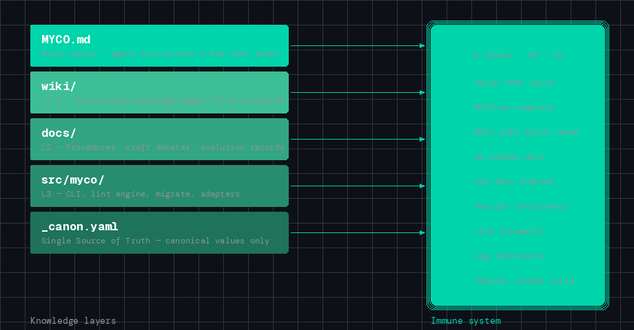

<div align="center">


# Myco

### 别的工具给你的 AI agent 记忆。Myco 给它代谢。

<br>

你和 AI 的每一次对话——每一个决策、每一次调试、每一场架构争论——都会在会话结束后消失。有些工具试图通过添加"记忆"来解决这个问题。但记忆本身不会问：*这还是真的吗？这和上周的决定矛盾吗？从那以后什么变了？*

Myco 给你的 AI agent 添加一个**代谢层**——跨会话验证知识的能力、在假设崩塌时进化自身结构的能力、以及将辛苦获得的模式蒸馏为可复用框架的能力。

<br>

[](https://pypi.org/project/myco/)
[](https://www.python.org/)
[](LICENSE)

<br>

[看效果](#它实际长什么样) · [快速开始](#快速开始) · [工作原理](#工作原理) · [为什么选-myco](#为什么选-myco) · [背后的故事](#背后的故事)

<br>

**Other Languages:** [English](README.md)

</div>

---

## 它实际长什么样

一个研究项目的第三天。你在用 Claude Code，`CLAUDE.md` 已经长到了 900 多行。你的 agent 在一个 wiki 页面里自信地引用了"v2 API 端点"——但 `_canon.yaml` 里说当前版本是 v3。部署文档里还提到了 v1 迁移。三个地方，三个不同的事实。没人发现。

用了 Myco 之后：

```
$ myco lint --project-dir ./my-research

============================================================
  Myco Knowledge System Lint
============================================================

  Checking L0 Canon 自检...           → PASS
  Checking L1 引用完整性...           → PASS
  Checking L2 数字一致性...           → ⚠ 1 issue
  Checking L3 过时模式扫描...         → PASS
  Checking L4 孤儿文档检测...         → ⚠ 1 issue
  Checking L5 log.md 覆盖度...        → PASS
  Checking L6 日期一致性...           → PASS
  Checking L7 Wiki 格式一致性...      → PASS
  Checking L8 .original 同步检查...   → PASS

  ⚠ 2 issue(s): 0 CRITICAL, 1 HIGH, 1 MEDIUM

  [HIGH] L2 | wiki/api_design.md
         references "v2 endpoint" but _canon.yaml says current_api_version = "v3"

  [MEDIUM] L4 | wiki/deployment.md
           exists but is not indexed in MYCO.md wiki_pages list
```

这就是 Myco 在工作。一个本会在接下来五个会话中悄悄累积的不一致——几秒内被捕获。

这不是假设。这是 `myco lint` 在真实项目上处理真实矛盾时的实际输出格式。`pip install myco` 安装的就是这个工具。

---

## 快速开始

```bash
pip install myco
```

**已经有 `CLAUDE.md` 了？** 这是最常见的路径。

```bash
# 非破坏性的——你的 CLAUDE.md 原样保留，Myco 在上面叠加结构
myco migrate ./your-project --entry-point CLAUDE.md

# 建立基线（全新脚手架显示零问题——这是预期的）
myco lint --project-dir ./your-project
```

工作几个会话。做决策。改主意。然后再次 lint——看它捕获你的 agent 没注意到的不一致。

**从头开始？**

```bash
myco init my-project --level 2
```

**从其他工具迁移？**

```bash
myco import --from hermes ~/.hermes/skills/     # Hermes 技能 → Myco wiki 存根
myco import --from openclaw ./MEMORY.md          # OpenClaw 记忆 → 结构化知识
```

详见 [`adapters/`](adapters/) 了解 Cursor、GPT 等集成指南。

---

## 工作原理

Myco 在你现有的项目文件旁创建四层知识架构：

<div align="center">

</div>

<br>

| 层级 | 作用 |
|------|------|
| **MYCO.md** | 入口文件，agent 每次会话都会读取。当前最重要内容的热区索引。 |
| **wiki/** | 结构化知识页——每页都由 `_canon.yaml`（唯一真相源）进行 lint 验证。 |
| **docs/** | 流程文档、辩论记录（传统手艺）、进化历史。项目的制度记忆。 |
| **src/myco/** | CLI、lint 引擎（9 项检查，L0–L8）、migrate、import、适配器。免疫系统。 |

四齿轮**进化引擎**让知识保持活力——不仅仅是存储：

| 齿轮 | 何时 | 做什么 |
|------|------|--------|
| **Gear 1** | 每次会话 | 感知摩擦——记录重复失败和意外行为 |
| **Gear 2** | 会话结束 | 反思——知识系统本身能改进什么？ |
| **Gear 3** | 里程碑时 | 回顾——挑战结构性假设（双环学习） |
| **Gear 4** | 项目结束 | 蒸馏——提取普适模式，回馈到 Myco |

---

## 为什么选 Myco

大多数 AI 开发工具在 **L-exec**（执行更快）或 **L-skill**（积累技能）层面运作。Myco 是唯一一个在 **L-struct** 和 **L-meta** 层面运作的工具——进化知识结构本身，以及进化"进化的规则"：

| 层级 | 做什么 | 谁在做 |
|------|--------|--------|
| L-exec | 随时间执行得更快 | 所有 agent |
| L-skill | 积累新技能 | Hermes、OpenClaw、CLAUDE.md |
| **L-struct** | **进化知识结构** | **Myco（Gear 3）** |
| **L-meta** | **进化"进化的规则"** | **Myco（Gear 4）** |

[Mem0 的 2026 AI Agent 记忆报告](https://mem0.ai/blog/state-of-ai-agent-memory-2026)明确将"记忆过时检测"列为**未解决挑战**——系统难以识别高相关性记忆何时变得过时。这正是 `myco lint` 解决的：9 项结构性检查，标记跨会话的不一致、矛盾和漂移。

这不是要取代记忆工具。Mem0 的检索做得很好。Myco 做的是验证和进化。它们是互补层。

---

## 兼容你现有的工具

Myco 不替代你的技术栈——它代谢它们。

| 工具 | 集成方式 | 你得到什么 |
|------|---------|----------|
| **Claude Code** | `myco migrate --entry-point CLAUDE.md` | 在现有 CLAUDE.md 上叠加一致性检查 + 进化引擎 |
| **Cursor** | 文件感知共存——无需迁移 | `.cursorrules` + Myco 在同一项目中共存 |
| **GPT / OpenAI** | 系统提示注入或 ChatGPT Projects | 每次会话的结构化上下文 |
| **Hermes Agent** | `myco import --from hermes ~/skills/` | 技能获得 lint 验证和进化追踪 |
| **OpenClaw** | `myco import --from openclaw MEMORY.md` | 记忆获得结构化和一致性检查 |
| **MemPalace** | L0 检索后端（适配器规范已提供） | 在 Myco 管理的知识上进行语义搜索 |

---

## 真实验证

Myco 诞生于一个真实项目——一个为期 8 天、80+ 文件的学术研究，走完了完整的四齿轮进化周期。数据：

<table>
<tr>
<td align="center"><b>80+</b><br><sub>管理的文件</sub></td>
<td align="center"><b>10</b><br><sub>进化的 wiki 页</sub></td>
<td align="center"><b>15+</b><br><sub>轮结构化辩论</sub></td>
<td align="center"><b>9/9</b><br><sub>lint 检查全通过</sub></td>
</tr>
</table>

通过 Gear 4 蒸馏提取的框架模式现在就在 Myco 代码库中——这个工具真的从第一个用户的经验中进化而来。完整生命周期详见 [`examples/ascc/`](examples/ascc/)。

---

## 背后的故事

<!-- 
  维护者注意：请用你自己的声音个性化这个部分。
  下面的故事基于真实的 ASCC 项目起源。请自由编辑。
-->

第一天。我有一个 `CLAUDE.md`——949 行，每次会话都在增长。项目上下文、决策、指令、警告，全在一个文件里。一开始很好用，直到它不再好用。

第二天。我什么都找不到了。949 行，没有结构。我把它拆成了层级——入口文件、wiki 页、流程文档、源代码。

第三天。改变一切的时刻。同一个指标出现在三个不同的地方，有三个不同的值。我的 agent 自信地使用着三个版本。没人发现——agent 没发现，我也没发现。那一刻我写了 `myco lint` 的第一个版本。

第五天。Wiki 页面开始不一致。缺少的 header、孤立的文件、断裂的引用。我添加了更多 lint 检查——L0 到 L8——以及一个规范值文件（`_canon.yaml`）作为唯一真相源。

第七天。第一次里程碑回顾。我发现 40% 的摩擦来自"改了内容，忘了更新索引"。双环学习：知识系统进化了自己的规则。

第八天。我意识到这个系统不是项目特定的。四个层级、lint 检查、进化齿轮——它们是普适模式。我把它命名为 Myco，来自 mycelium（菌丝体）：地下网络，通过在生物体之间代谢养分来维持整个生态系统的生命。

我从那个第一个项目中提取的框架现在帮助着每个使用 Myco 的项目。这就是 Gear 4 在工作——一个项目辛苦获得的知识，成为下一个项目的起点。

---

## 贡献

最有价值的贡献不是代码——而是真实使用中产生的**知识进化产物**：实战报告（battle reports）、适配器集成、wiki 模板和工作流原则。

详见 [CONTRIBUTING.md](CONTRIBUTING.md) 了解四种贡献类型。最快的 PR 合并路径是一份分享 Myco 在你项目中如何工作（或不工作）的实战报告，或一个你已在使用的工具的 [`adapters/`](adapters/) YAML。

---

## 许可证

MIT. 见 [LICENSE](LICENSE)。
